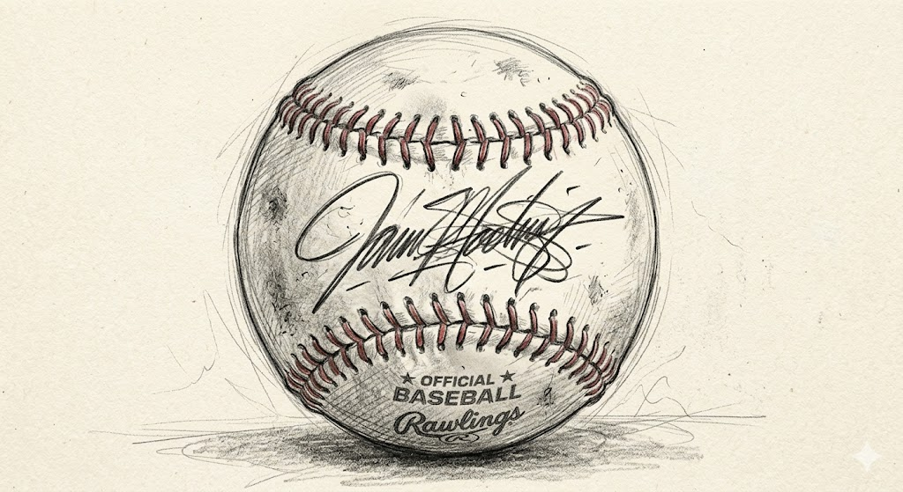
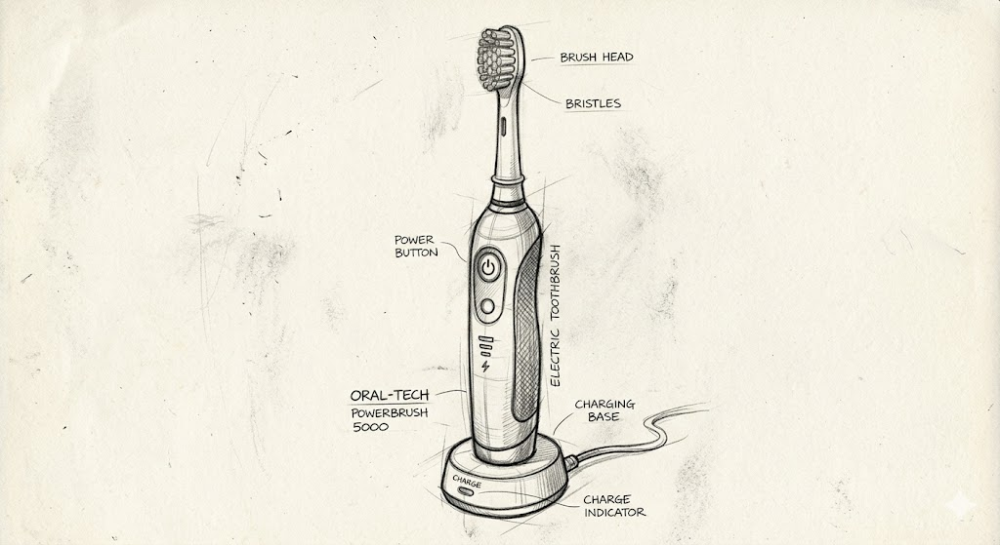
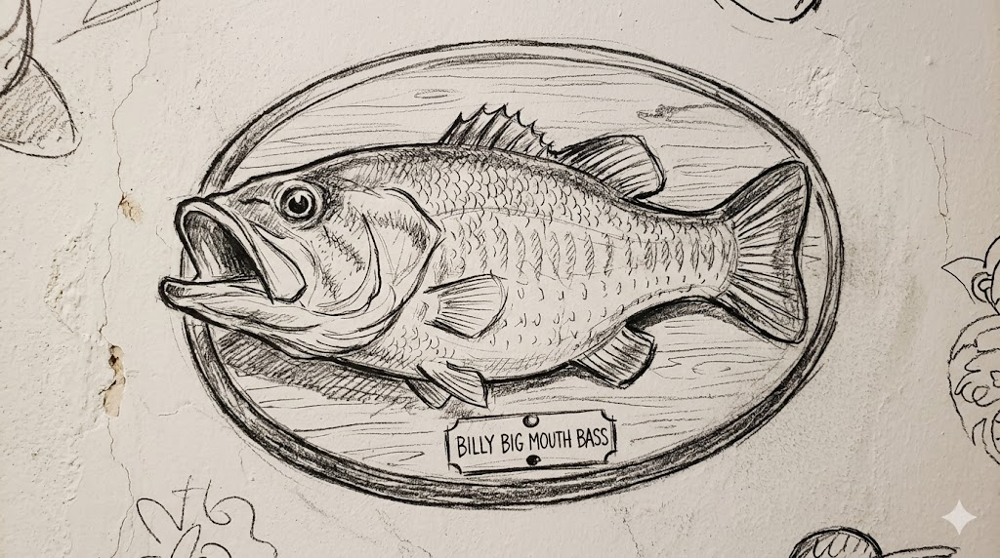
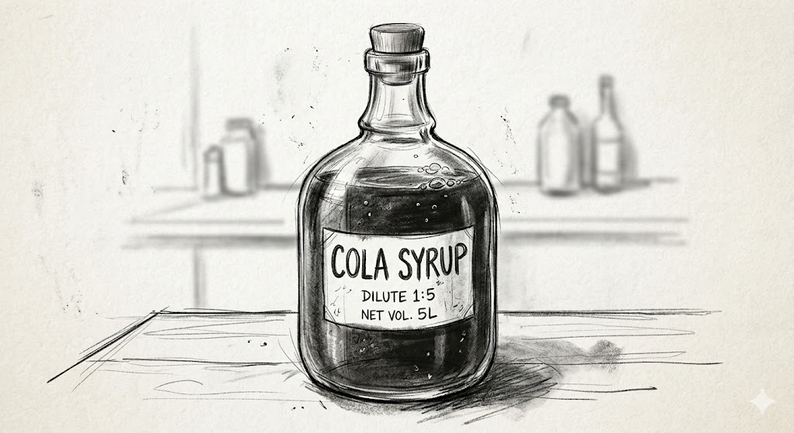
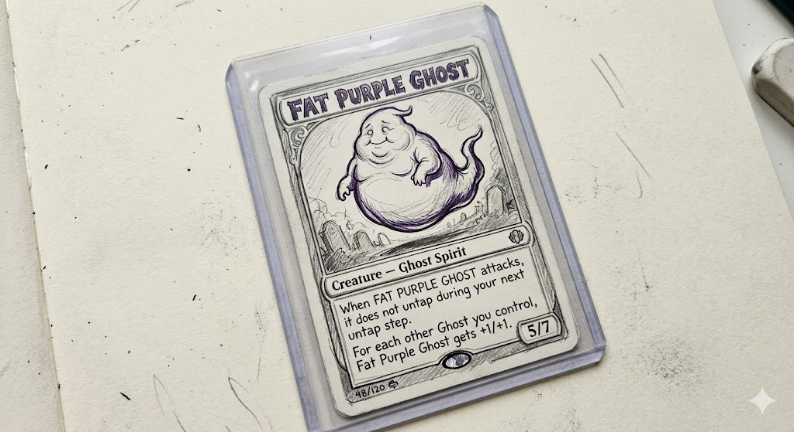
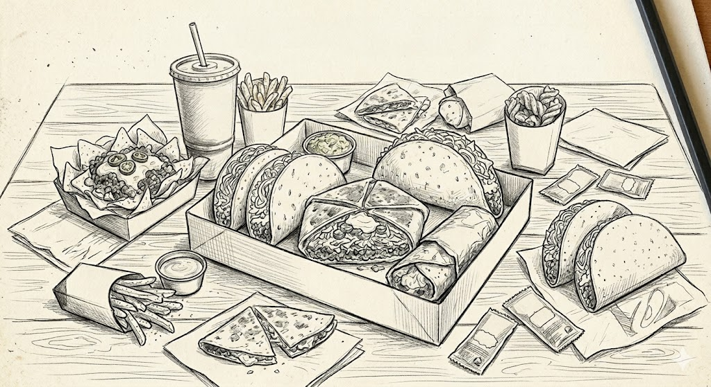

# Bounties

During the poker tournament, we'll be awarding bounty prizes—these are special rewards for knocking specific players out, regardless of how the rest of your tournament goes.

If you'd like to put a bounty on yourself or another player, please contact Richard Abdill at [rich@cardsforacure.org](mailto:rich@cardsforacure.org). If you're interested in contributing a bounty but can't think of a good prize, **[use our Amazon wishlist as inspiration.](https://www.amazon.com/hz/wishlist/ls/1T3A6TVLAXBF5?ref_=wl_share)**

## Nick's Bounty

### Nick
{: .bounty-img}
*   **The Bounty:** An autographed baseball from an Oriole that wasn't very good.
*   **The Why:** Cancer couldn't knock out Nick, but you can! (We went back and forth on this joke for weeks, but we're leaving it in.) As a true Oriole fan, Nick knows that if you have star players' memorabilia, you're a fraud.

## Nick's Parents

### Julie (Nick's Mom)
{: .bounty-img-left}
*   **The Bounty:** A nice new electric toothbrush.
*   **The Why:** As a dental hygienist of great renown, Julie's bounty is actually pretty nice!

### Steve (Nick's Dad)
{: .bounty-img}
*   **The Bounty:** A Big Mouth Billy Bass.
*   **The Why:** Steve's already graciously donated our grand prize, a custom fishing rod. Knock Steve out along the way to victory and complete the set.

## Nick's Pals

### Rich Abdill
{: .bounty-img-left}
*   **The Bounty:** A jug of BOOST! Cola syrup.
*   **The Why:** Non-New Jerseyites won't know the deep lore and delicious taste of BOOST! Cola. Knock Rich out of the tournament, and you will be let in to the brotherhood.

### Rob Gindes
{: .bounty-img}
*   **The Bounty:** A Pokemon card from Rob's personal collection.
*   **The Why:** Collecting Pokemon cards "for their kids" is one of many hobbies Rob and Nick share. Knocking Rob out will earn you a card from Rob's personal collection, depicting Rob's favorite character Gengar, a fat purple ghost.

### John Banusiewicz
{: .bounty-img-left}
*   **The Bounty:** Taco Bell gift card.
*   **The Why:** What more bounty could there possibly be, than the bounty of a delicious feast, consumed according to the Live Más lifestyle?
