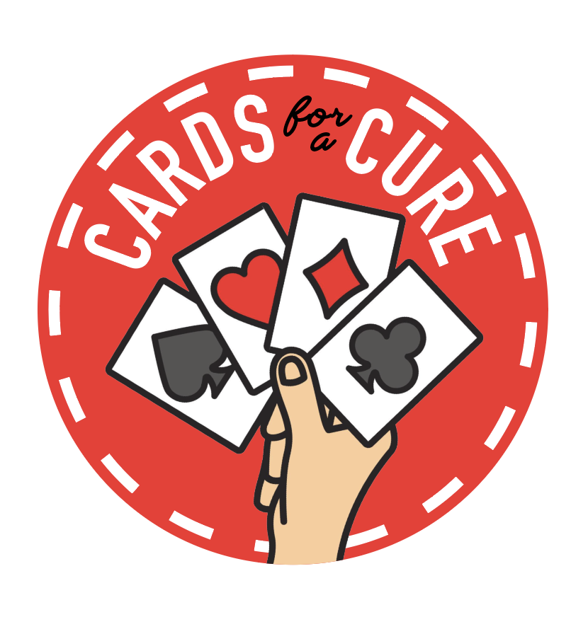

# Cards for a Cure 2026

[Donate here to receive a tournament entry](https://pages.lls.org/voy/rm/denver26/vpoker)
[Put a bounty on a player!](https://www.amazon.com/hz/wishlist/ls/1T3A6TVLAXBF5?ref_=wl_share)

This is a fully virtual, beginner-friendly Texas Hold’em poker tournament. **No software or download required**—just a browser and your competitive spirit! This is an informational page for the 2026 Cards for a Cure Poker Tournament detailing prizes and awards available to participants.

## Tournament awards

The winner of the tournament will receive this handmade First Place trophy, featuring poker chips suspended within the logo of Blood Cancer United.

The **first player eliminated from the tournament** will receive this handmade Last Place trophy, featuring poker chips glued to the scrap wood left over from making the other trophy.

## Bounties

### How it works

### The Rules

* All players are eligible for gifts, but we will only address packages to adults 18 years or older.
* A bounty is awarded for a player's **first tournament knockout**. If a player has a bounty on their head, and they run out of chips, the opponent who takes those final chips will also receive the bounty.
  * (Players have the option to "rebuy" by donating for an additional tournament entry. This does not affect gifts from the hand that eliminated them.)
* If a player has a bounty on their head and is eliminated in a hand with a side pot, their bounty will be awarded to the opponent who wins the pot containing the player's final chips. If there are multiple side pots or a dispute about whom should receive the bounty chip, it will be awarded to **the opponent Nick likes the most**.
