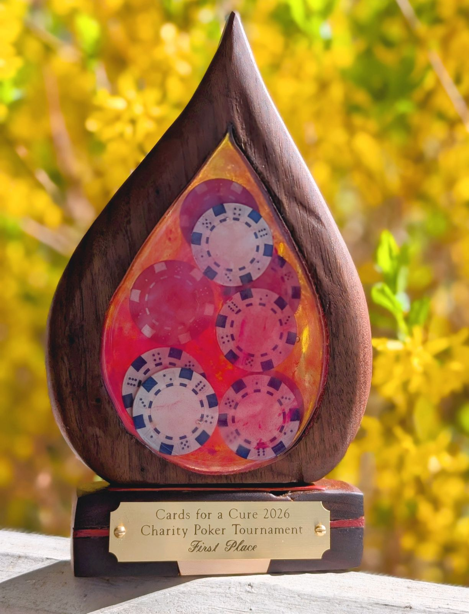
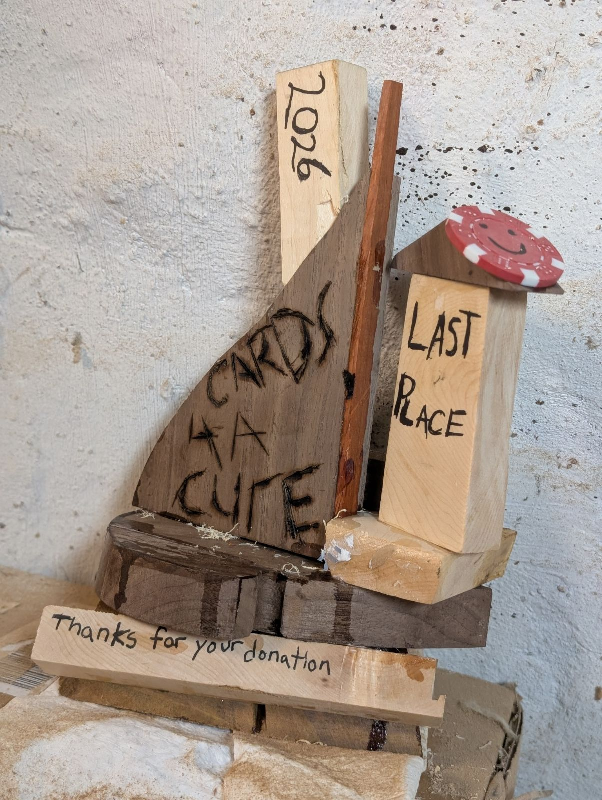

# Cards for a Cure 2026

## Charity poker tournament in support of leukemia and lymphoma research

* **[Donate here to receive a tournament entry](https://pages.lls.org/voy/rm/denver26/vpoker)**
* **[Put a bounty on a player!](https://www.amazon.com/hz/wishlist/ls/1T3A6TVLAXBF5?ref_=wl_share)**

Cards for a Cure is a **fully virtual, beginner-friendly Texas Hold’em charity poker tournament** to be held Sunday, April 26, 2026, at 6:30 pm EDT.

**All proceeds go directly to Blood Cancer United**, a 501(c)(3) charitable organization founded in 1949 to fund lifesaving research, provide critical support services, and improve access to care for people facing blood cancer. Lymphoma survivor and BCU [Visionary of the Year candidate Nick Werner](https://pages.lls.org/voy/rm/denver26/nwerner) is organizing this fundraiser as part of his campaign to raise **$91,525 for leukemia and lymphoma research**.

You can read his story [on the BCU website](https://pages.lls.org/voy/rm/denver26/nwerner), and you will receive one entry to the tournament with a $100 donation to the Visionary of the Year campaign. To receive an entry, it's important you donate through the [tournament donation page](https://pages.lls.org/voy/rm/denver26/vpoker) using one of the established donation tiers.

## Tournament awards

The winner of the tournament will receive this **handmade First Place trophy**, featuring poker chips suspended within the logo of Blood Cancer United.

{: .align-right}

The **first player eliminated from the tournament** will receive this **handmade Last Place trophy**, featuring poker chips glued to the scrap wood left over from making the other trophy.
{: .align-right}

## Bounties

This poker tournament features **player bounties**, gifts awarded to players for eliminating other players. If a player has a bounty on their head, the opponent to eliminates them will receive their bounty—possibly a blender, some doctor-recommended anti-cavity gum, or a can of spray paint. **[Anyone can take out a bounty on a player](https://www.amazon.com/hz/wishlist/ls/1T3A6TVLAXBF5?ref_=wl_share)**, including people outside the tournament and the player themselves.

This Amazon wishlist includes the growing list of bounties already purchased **and many that are still available**, for prices as low as $7 (the green spray paint) or as luxurious as $52.99 (Big Mouth Billy Bass). To offer a bounty, please purchase the registry item through Amazon.com. When prompted for a note, please specify the bounty target's name and a good way for us to contact you in case clarification is needed.

We'll take care of everything from there—we'll be announcing wins and providing regular reminders about which players have available bounties throughout the tournament. Once the tournament is over, we'll coordinate with the recipient and mail it off.

### The Rules

* All players are eligible for gifts, but we will only address packages to adults 18 years or older.
* A bounty is awarded for a player's **first tournament knockout**. If a player has a bounty on their head, and they run out of chips, the opponent who takes those final chips will also receive the bounty. (Players have the option to "rebuy" by donating for an additional tournament entry. This does not affect gifts from the hand that eliminated them.)
* If a player has a bounty on their head and is eliminated in a hand with a side pot, their bounty will be awarded to the opponent who wins the pot containing the player's final chips. If there are multiple side pots or a dispute about whom should receive the bounty chip, it will be awarded to **the opponent Nick likes the most**.

### Contact

* Donations are all handled directly by Blood Cancer United. If you have questions about your financial transaction, contact Blood Cancer United via email at SupportServices -at- bloodcancerunited.org or via phone at 1-888-557-7177.
* For questions about gifts or to coordinate bounties, please contact Richard Abdill at rich@cardsforacure.org.
* For questions about the fundraiser and the Visionary of the Year campaign, contact Nick Werner at nick@cardsforacure.org.

Thank you very much for your support. Looking forward to pulling up a chair next to you on Sunday the 26th.
